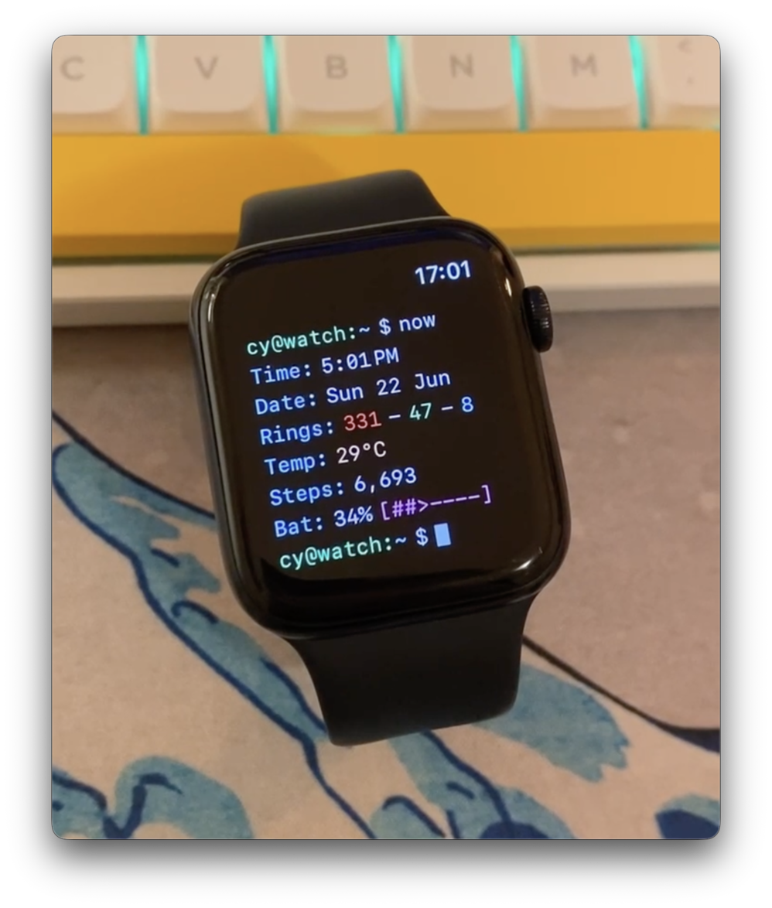
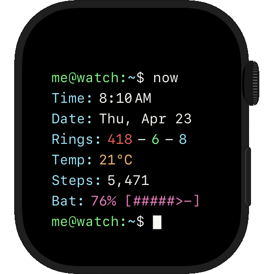
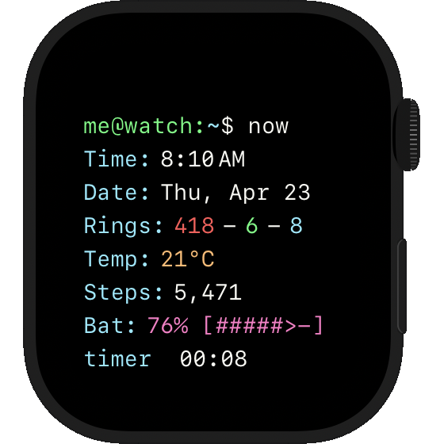
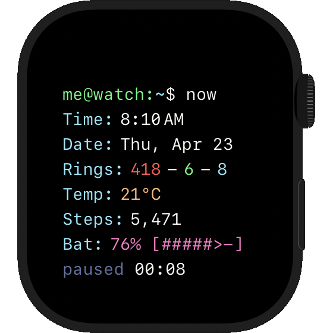

# watch-terminal.sh

**watch-terminal.sh** is a terminal-style watch face for the Apple Watch, inspired by 
[TermiWatch](https://github.com/kuglee/TermiWatch).

(i made this for my own apple watch because terminals are cool)

Photo (on my apple watch SE 2):

    

Screenshot:

    

Also includes a little timer:

- tap once = reveal the timer and start/pause the timer
- tap twice = reset the timer to 0
- tap thrice = hide the timer, show the prompt with the blinking cursor again

    
    

